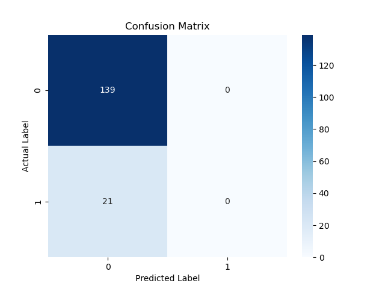
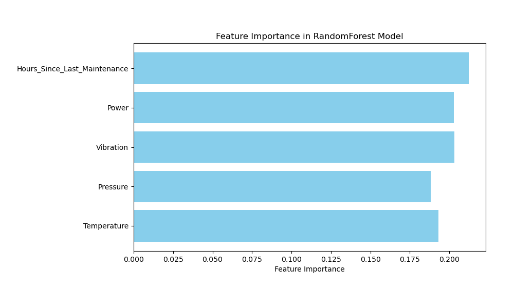

### `README.md`

# Predictive Maintenance for Manufacturing Equipment

## Table of Contents
- [Introduction](#introduction)
- [Project Overview](#project-overview)
- [Features](#features)
- [Technologies Used](#technologies-used)
- [Installation](#installation)
- [Usage](#usage)
- [Data](#data)
- [Model Training](#model-training)
- [Results](#results)
- [License](#license)

## Introduction
This project aims to develop a predictive maintenance system for manufacturing equipment using machine learning techniques. The system analyzes various machine parameters to predict potential failures, thereby allowing proactive maintenance actions to reduce downtime and improve operational efficiency.


## Project Overview
The predictive maintenance model utilizes data such as temperature, pressure, vibration, power consumption, and hours since the last maintenance to predict equipment failures. The project includes a user-friendly GUI that allows users to upload datasets and visualize predictions.
```
/main
└───predictive_maintenance_project-main
    │   Figure_1.png
    │   Figure_2.png
    │   Figure_3.png
    │   LICENSE
    │   README.md
    │   requirements.txt
    │
    ├───data
    │   │   gndset.py
    │   │
    │   ├───processed
    │   │       processed_data.csv
    │   │
    │   └───raw
    │           machine_data.csv
    │
    ├───models
    │       model.pkl
    │
    ├───src
    │       data_processing.py
    │       gui_prediction.py
    │       train.py
    │       __init__.py
    │
    └───test
            dt2.py
            finaldt3.py
            machine_data_large.xlsx
            synthetic_dataset.xlsx
            testdset.py
            test_data.xlsx
```

## Features
- **Data Loading**: Users can upload Excel files containing machine data.
- **Failure Prediction**: The model predicts failures based on input features.
- **Result Visualization**: The application displays both loaded data and machines needing maintenance.
- **Scrollbars**: The GUI includes horizontal and vertical scrollbars for easy navigation through large datasets.


## Technologies Used
- **Programming Language**: Python
- **Libraries**: 
  - `pandas`: Data manipulation and analysis.
  - `numpy`: Numerical operations.
  - `scikit-learn`: Machine learning algorithms.
  - `matplotlib` and `seaborn`: Data visualization.
  - `openpyxl`: Reading and writing Excel files.
  - `tkinter`: GUI development.

## Installation
1. Clone the repository:
   ```bash
   git clone https://github.com/2310030224-PranayVarma/predictive_maintenance_project
   cd predictive_maintenance_project
   ```

2. Install the required packages:
   ```bash
   pip install -r requirements.txt
   ```

## Usage
1. Run the application:
   ```bash
   python src/gui_prediction.py
   ```

2. Upload an Excel file containing the required machine data, some of the sample test datasets are provided in the test/ folder which are in the xlsx format files.

3. The application will display the loaded data and highlight machines needing maintenance.

## Data
The dataset must contain the following columns:
- `Machine_ID`: Unique identifier for each machine.
- `Temperature`: Operating temperature of the machine.
- `Pressure`: Operating pressure.
- `Vibration`: Vibration level.
- `Power`: Power consumption.
- `Hours_Since_Last_Maintenance`: Hours since the last maintenance.
- `Failures`: Binary indicator (0 or 1) for failure occurrence.

## Model Training
The model is trained using a Random Forest Classifier. The training and testing of the model are performed using historical machine data to ensure accurate predictions. 

## Results
- The model achieved an accuracy of approximately `92%` on test data.
- 
- A confusion matrix and classification report provide insights into model performance.
- 
- 


## License
This project is licensed under the MIT License - see the [LICENSE](LICENSE) file for details.

## Acknowledgments
- [N. PRANAY VARMA](https://github.com/2310030224-PranayVarma ) - Project Creator
- Special thanks to OpenAI chatgpt for providing me the useful pseudorandom generated datasets.
